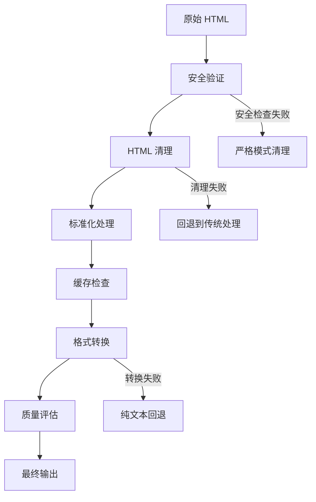

# HTML 处理系统优化指南

## 🎯 优化概述

我们已经实现了一个全新的、基于最佳实践的 HTML 处理系统，解决了之前系统中的关键问题：

### ✅ 主要改进

1. **安全性增强**：完整的 HTML 清理和 XSS 防护
2. **性能优化**：LRU 缓存机制，避免重复处理
3. **健壮性提升**：多层回退机制，确保内容始终可显示
4. **标准化处理**：统一的标题标签转换，符合 Quill 编辑器规范
5. **质量监控**：内容验证和质量评估工具

### 🔧 核心组件

| 组件 | 功能 | 文件路径 |
|------|------|----------|
| **htmlProcessor.ts** | 安全的 HTML 清理和标准化 | `lib/utils/htmlProcessor.ts` |
| **contentStrategy.ts** | 内容获取策略（已优化） | `lib/utils/contentStrategy.ts` |
| **contentValidator.ts** | 内容验证和质量检查 | `lib/utils/contentValidator.ts` |

## 🚀 使用方法

### 1. 基础内容显示

```typescript
import { getDisplayContent } from '@/lib/utils/contentStrategy';

// 异步版本（推荐，使用新的处理器）
const content = await getDisplayContent(clip, {
  fallbackToPlainText: true,
  logErrors: true
});

// 同步版本（向后兼容）
import { getDisplayContentSync } from '@/lib/utils/contentStrategy';
const content = getDisplayContentSync(clip, {
  fallbackToPlainText: true,
  logErrors: false
});
```

### 2. 高级 HTML 处理

```typescript
import { processHtml } from '@/lib/utils/htmlProcessor';

const result = await processHtml(htmlContent, {
  normalizeHeadings: true,    // 标准化标题标签
  removeStyles: true,         // 移除样式属性
  removeScripts: true,        // 移除脚本标签
  strictMode: false,          // 是否启用严格模式
  useCache: true,            // 使用缓存优化
});

if (result.success) {
  console.log('处理成功:', result.html);
  console.log('统计信息:', result.stats);
} else {
  console.error('处理失败:', result.error);
}
```

### 3. 内容质量验证

```typescript
import { validateClipContent } from '@/lib/utils/contentValidator';

const validation = validateClipContent(clip, {
  checkSecurity: true,
  checkPerformance: true,
  checkFormat: true,
  checkContent: true,
});

console.log('验证结果:', validation.isValid);
console.log('质量分数:', validation.score);
console.log('安全风险:', validation.summary.securityRisk);
console.log('质量等级:', validation.summary.qualityGrade);
```

## 📊 处理流程

### 新的内容处理流程



### 回退机制

1. **主要路径**：新 HTML 处理器 → 安全清理 → 标准化输出
2. **第一回退**：传统 HTML 转译器
3. **第二回退**：原始 HTML 直接显示
4. **最终回退**：纯文本内容
5. **保底方案**：标题或错误信息

## 🔧 配置选项

### HTML 处理器选项

```typescript
interface ProcessingOptions {
  removeStyles?: boolean;      // 移除样式属性 (默认: true)
  removeScripts?: boolean;     // 移除脚本标签 (默认: true)
  normalizeHeadings?: boolean; // 标准化标题 (默认: true)
  maxLength?: number;          // 最大处理长度 (默认: 100KB)
  useCache?: boolean;          // 启用缓存 (默认: true)
  strictMode?: boolean;        // 严格模式 (默认: false)
}
```

### 内容策略选项

```typescript
interface ContentOptions {
  fallbackToPlainText?: boolean;  // 回退到纯文本 (默认: true)
  logErrors?: boolean;            // 记录错误 (默认: true)
  preserveFormatting?: boolean;   // 保留格式 (默认: true)
}
```

## 📈 性能优化

### 缓存机制

- **LRU 缓存**：最多缓存 1000 个处理结果
- **TTL 设置**：缓存 30 分钟自动过期
- **缓存键**：基于内容哈希和处理选项

### 性能监控

```typescript
import { getCacheStats } from '@/lib/utils/htmlProcessor';

const stats = getCacheStats();
console.log('缓存统计:', stats);

// 清除缓存（如需要）
import { clearCache } from '@/lib/utils/htmlProcessor';
clearCache();
```

## 🛡️ 安全特性

### 安全清理

- **移除危险标签**：script, iframe, object, embed 等
- **清理危险属性**：onclick, onload, style 等事件处理器
- **过滤危险协议**：javascript:, data:, vbscript: 等
- **属性白名单**：只保留安全的属性

### 安全验证

```typescript
import { quickSecurityCheck } from '@/lib/utils/contentValidator';

const isSafe = quickSecurityCheck(htmlContent);
if (!isSafe) {
  console.warn('检测到潜在的安全风险');
}
```

## 🔍 调试和监控

### 详细日志

新系统提供详细的处理日志：

```typescript
// 启用详细日志
const content = await getDisplayContent(clip, { logErrors: true });

// 日志示例:
// ✅ HTML处理成功 Clip 123: {
//   originalLength: 2048,
//   processedLength: 1856,
//   processingTime: '12.5ms',
//   removedTags: ['script', 'style'],
//   source: 'processed'
// }
```

### 质量监控

```typescript
import { batchValidateClips, getValidationStats } from '@/lib/utils/contentValidator';

// 批量验证
const results = batchValidateClips(clips);

// 统计分析
const stats = getValidationStats(results);
console.log('验证统计:', {
  有效率: `${stats.validRate.toFixed(1)}%`,
  平均分: stats.averageScore.toFixed(1),
  安全风险: stats.securityRisks,
  等级分布: stats.gradeDistribution
});
```

## 🔄 迁移指南

### 当前组件

大部分现有组件无需修改，因为我们保持了 API 兼容性：

```typescript
// 原有代码继续工作
import { getDisplayContent } from '@/lib/utils/contentStrategy';
const content = getDisplayContent(clip); // 自动使用新的处理器
```

### 新功能采用

逐步采用新功能：

```typescript
// 1. 开始时使用同步版本
import { getDisplayContentSync } from '@/lib/utils/contentStrategy';

// 2. 准备好后升级到异步版本
import { getDisplayContent } from '@/lib/utils/contentStrategy';

// 3. 启用高级功能
import { processHtml, validateClipContent } from '@/lib/utils/htmlProcessor';
```

## 📋 最佳实践

### 1. 内容处理

- **优先使用异步版本**：获得最佳处理效果
- **启用缓存**：提升重复访问性能
- **设置合理的错误处理**：确保用户体验

### 2. 安全考虑

- **启用安全验证**：特别是处理用户生成内容时
- **使用严格模式**：处理敏感内容时
- **定期验证内容**：监控内容质量

### 3. 性能优化

- **监控缓存命中率**：调整缓存策略
- **批量处理**：使用批量 API 处理大量内容
- **设置合理的限制**：避免处理过大的内容

## 🐛 故障排除

### 常见问题

1. **内容显示为空**
   - 检查是否启用了过严格的清理
   - 验证原始内容是否有效
   - 查看控制台错误日志

2. **性能问题**
   - 检查缓存是否启用
   - 监控内容大小
   - 考虑使用批量处理

3. **安全警告**
   - 使用内容验证工具检查
   - 启用严格模式清理
   - 考虑预处理内容

### 调试技巧

```typescript
// 启用详细日志
const result = await processHtml(html, { 
  useCache: false,  // 禁用缓存以便调试
});

// 检查处理统计
console.log('处理详情:', {
  success: result.success,
  error: result.error,
  stats: result.stats,
  removedTags: result.stats.removedTags
});

// 验证内容质量
const validation = validateClipContent(clip, {
  checkSecurity: true,
  checkPerformance: true,
});
console.log('验证结果:', validation);
```

## 📚 API 参考

完整的 API 文档请参考各组件的 TypeScript 定义和内联注释。主要的导出函数包括：

- `processHtml()` - 核心 HTML 处理
- `getDisplayContent()` - 异步内容获取
- `getDisplayContentSync()` - 同步内容获取
- `validateClipContent()` - 内容验证
- `quickSecurityCheck()` - 快速安全检查

---

这个优化后的系统为您的应用提供了强大、安全、高性能的 HTML 内容处理能力。通过合理配置和使用，可以显著提升用户体验和系统稳定性。
